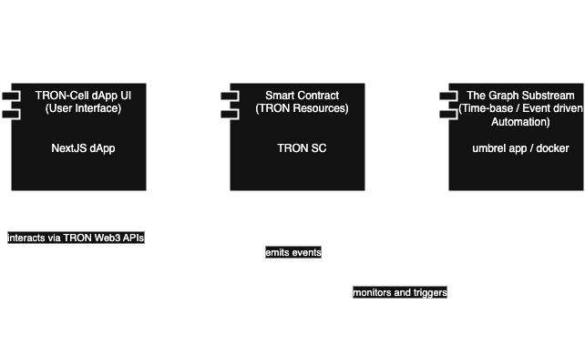

# TRON Cell (Under Development)

TRON Resources manager and Contract Automation tool


## Architecture


High-Level Component Diagram



## Configuration

### SC

### Dapp

### umbrel app / substream Docker

## Contract Compiling 

To compile your contracts, use the following command:

```shell
tronbox compile
```

## Migration

The project comes pre-configured with four separate networks:

- Mainnet (https://api.trongrid.io)
- Shasta Testnet (https://api.shasta.trongrid.io)
- Nile Testnet (https://nile.trongrid.io).
- Localnet (http://127.0.0.1:9090)

### Mainnet

To deploy your contracts to Mainnet, you can run the following:

```shell
tronbox migrate --network mainnet
```

### Shasta Testnet

Obtain test coin at https://shasta.tronex.io/

To deploy your contracts to Shasta Testnet, you can run the following:

```shell
tronbox migrate --network shasta
```

### Nile Testnet

Obtain test coin at https://nileex.io/join/getJoinPage

To deploy your contracts to Nile Testnet, you can run the following:

```shell
tronbox migrate --network nile
```

### Localnet

The TronBox Runtime Environment provides a complete development framework for Tron, including a private network for testing.

Get tronbox/tre docker image at https://hub.docker.com/r/tronbox/tre

To deploy your contracts to Localnet, you can run the following:

```shell
tronbox migrate
```

## Testing

To test your contracts, you can run the following:

```shell
tronbox test --network <mainnet|shasta|nile|development>
```
